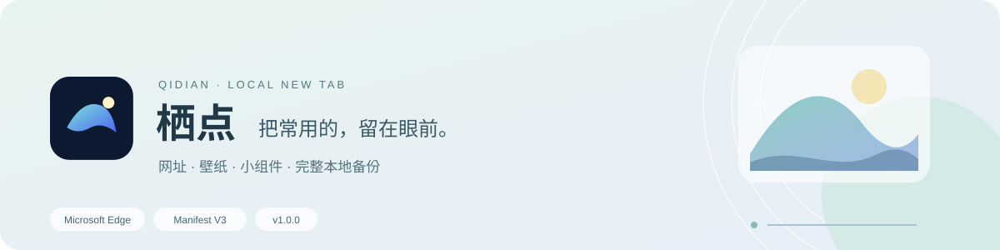
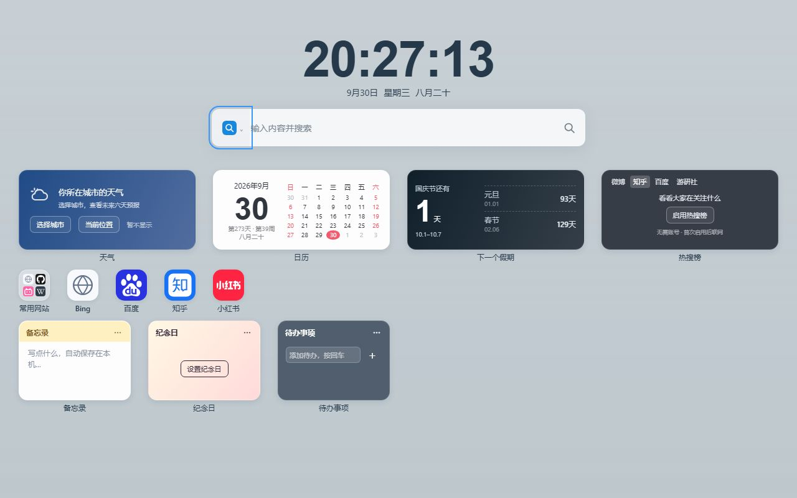
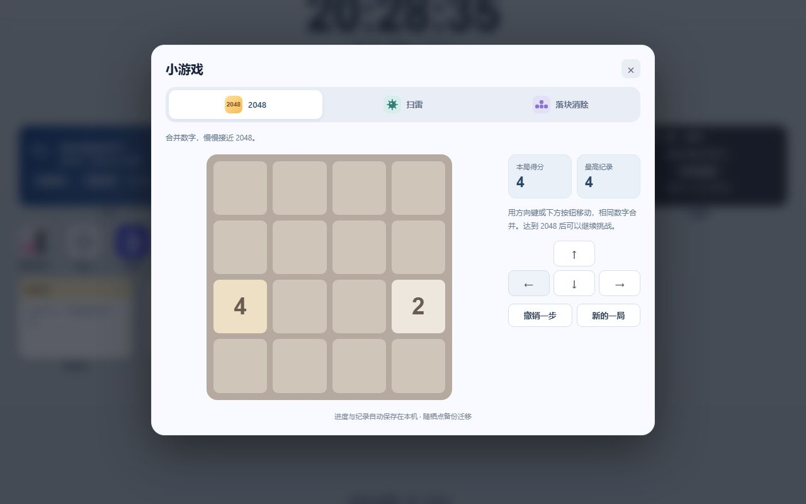
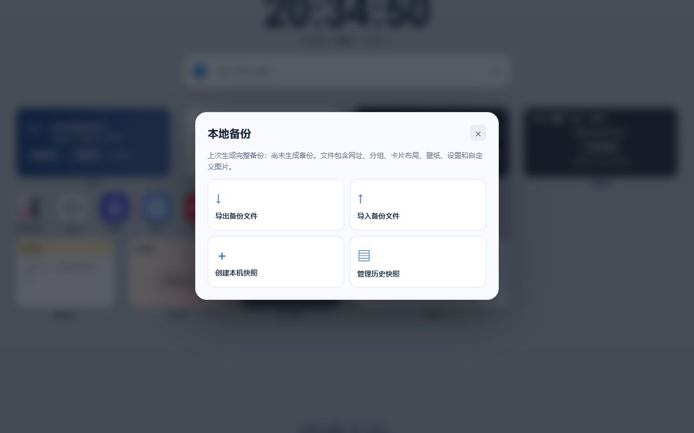

<p align="center">
  
</p>

<p align="center">
  一个可以按你的习惯布置的 Microsoft Edge 新标签页。<br>
  常用网址、时间与小工具放在一页，布局和图片保存在本机。
</p>

<p align="center">
  <a href="https://github.com/inoat/qidian-newtab/raw/refs/heads/main/dist/qidian-edge-1.0.0.zip"><strong>下载 v1.0.0</strong></a>
  &nbsp; · &nbsp;
  <a href="https://inoat.github.io/qidian-newtab/">项目主页</a>
  &nbsp; · &nbsp;
  <a href="https://inoat.github.io/qidian-newtab/privacy.html">隐私政策</a>
  &nbsp; · &nbsp;
  <a href="https://github.com/inoat/qidian-newtab/issues">反馈与建议</a>
</p>

<p align="center">
  <a href="#界面预览">界面预览</a> · <a href="#功能一览">功能一览</a> · <a href="#开始使用">开始使用</a> · <a href="#备份与迁移">备份与迁移</a> · <a href="#数据与隐私">数据与隐私</a>
</p>

---

## 界面预览

<p align="center">
  
  <br>
  <sub>首页 · 把网址和日常组件放在顺手的位置</sub>
</p>

<table>
  <tr>
    <td width="50%" align="center">
      <br>
      <strong>给休息留一点空间</strong><br>
      <sub>2048、扫雷与落块消除，进度保存在本机</sub>
    </td>
    <td width="50%" align="center">
      <br>
      <strong>把熟悉的首页带走</strong><br>
      <sub>导出、导入与历史快照，方便换电脑继承</sub>
    </td>
  </tr>
</table>

## 功能一览

<table>
  <tr>
    <td width="33%" valign="top">
      <strong>网址与分组</strong><br><br>
      快捷方式、文件夹与多个分组。支持右键添加、拖动排序和键盘移动，也可以上传自己的图标。
    </td>
    <td width="33%" valign="top">
      <strong>搜索与快捷入口</strong><br><br>
      必应、百度、Google、自定义 HTTPS 引擎与本地网址搜索。搜索结果和网址在新标签页打开。
    </td>
    <td width="33%" valign="top">
      <strong>按喜好调整外观</strong><br><br>
      纯色、渐变和本地壁纸；可调字体、颜色、遮罩与透明度，以及图标间距和卡片尺寸。
    </td>
  </tr>
  <tr>
    <td valign="top">
      <strong>日常信息与记录</strong><br><br>
      日历、农历、下一个假期、备忘录、待办、纪念日、番茄钟、世界时钟和可开关的一言。
    </td>
    <td valign="top">
      <strong>工具与小游戏</strong><br><br>
      计算器、时间戳、单位换算；2048、扫雷、落块消除。工具和游戏均可在本地使用。
    </td>
    <td valign="top">
      <strong>完整备份与恢复</strong><br><br>
      可读的 .qidian.json 文件保存界面、网址、布局、图片和组件数据。导入前预览，并保留本机快照。
    </td>
  </tr>
</table>

天气和资讯榜单可按需开启；微博、知乎、百度榜单来自 NewsNow，游研社显示官方 RSS 最新文章。第三方服务的可用性取决于其运营者。

## 开始使用

> 当前版本为 **1.0.0**。Microsoft Edge 扩展商店版本仍在准备提交，尚未通过审核；现在可以手动加载使用。

### 1. 下载并解压

下载 [**qidian-edge-1.0.0.zip**](https://github.com/inoat/qidian-newtab/raw/refs/heads/main/dist/qidian-edge-1.0.0.zip)，解压到一个固定的文件夹。安装包校验值见 [SHA256.txt](dist/SHA256.txt)。

### 2. 加载到 Edge

在地址栏输入：

```text
edge://extensions
```

开启 **开发人员模式** → 选择 **加载解压缩的扩展** → 选中直接包含 `manifest.json` 的文件夹。

### 3. 布置你的首页

打开新标签页，阅读首次使用说明，然后按自己的习惯添加内容。

| 想做什么 | 操作方式 |
| :--- | :--- |
| 添加网址或组件 | 在页面空白处右键；键盘可聚焦内容区域后按 `Shift + F10` |
| 调整分组和外观 | 鼠标移到页面左边缘，展开侧边栏 |
| 调整内容顺序 | 拖动卡片，或使用键盘移动操作 |
| 保存当前网页 | 点击 Edge 工具栏中的栖点扩展按钮 |
| 开启天气或热搜 | 进入相应组件设置，主动开启并按提示授权 |

已克隆仓库的用户，也可直接加载 `extension/` 目录。

## 备份与迁移

**一份备份，带走整个首页。**

1. 在右键菜单或侧边栏进入 **备份与恢复**，导出 `.qidian.json` 文件。
2. 在新电脑安装扩展，选择 **导入备份文件**。
3. 检查导入预览，确认恢复网址、图片、设置和组件布局。

| 会保存什么 | 包含的内容 |
| :--- | :--- |
| 网址与结构 | 网址、分组、文件夹、排序、卡片尺寸 |
| 界面与图片 | 壁纸、自定义图标、时钟、搜索栏和外观设置 |
| 组件数据 | 笔记、待办、计时工具、游戏进度与纪录等 |

> 备份文件是可读的 JSON，**未经加密**，请自行保管。商店版与手动加载版的扩展 ID 不同，需要通过导出、导入迁移；卸载前请先备份。

<details>
<summary>从旧版迁移时的图标说明</summary>

旧版的用户上传图片可以随备份恢复；只引用旧图标库的快捷方式，可能按域名重新匹配或使用默认图标。

</details>

## 数据与隐私

**无需账号 · 没有广告或遥测 · 工作区保存在本机**

- **本地保存**：网址、布局、笔记、壁纸和组件数据保存在当前浏览器的本地存储或 IndexedDB，不自动同步到账号或上传给发布者。
- **按需联网**：天气与热搜默认关闭。使用第三方服务、搜索或打开网址时，会向相应服务发送请求。
- **位置需确认**：主动读取设备位置并再次确认后，才保存和向天气接口发送取整到 `0.1°` 的坐标，不持续定位。
- **权限按用途使用**：收藏夹只在主动导入并授权后读取；工具栏按钮只读取当前网页的标题和地址，供你确认添加。

完整说明见 [**隐私政策**](https://inoat.github.io/qidian-newtab/privacy.html)。项目介绍和政策网页由 GitHub Pages 托管。

## 项目与维护

<details>
<summary><strong>开发、构建与目录结构</strong></summary>

无需 npm 依赖。使用 Python 3.9+ 与 Node.js 20+，在仓库根目录运行：

```sh
python scripts/verify.py
python scripts/package.py
```

```text
qidian-newtab/
├── extension/   可直接加载的扩展源码
├── docs/        项目主页与隐私政策
├── assets/      图标来源、演示截图与 README 图形
├── scripts/     校验与安装包构建
├── tests/       备份、工具和游戏功能检查
└── dist/        安装包与 SHA-256 校验值
```

构建只打包 `scripts/runtime-files.json` 列出的运行文件。更新运行文件或图标资源时，需要同步维护文件清单、来源和校验值。

GitHub Pages 使用 `main` 分支的 `/docs` 目录；公开政策与 `extension/privacy.html` 保持相同内容。

</details>

<details>
<summary><strong>资源来源与许可</strong></summary>

公开仓库包含清理后的商店版，不包含自用版复制的 iTab 图标库或个人网站配置。品牌 SVG 来自 Simple Icons 16.33.0，按 CC0 1.0 使用并保留来源声明。商标权属于对应品牌，本项目与其无隶属或背书关系。

详见 [THIRD_PARTY_NOTICES.txt](THIRD_PARTY_NOTICES.txt) 与 [图标来源记录](assets/icon-sources.json)。项目原创代码目前未指定开放源代码许可证；公开查看不等于授予再分发许可。

</details>

<details>
<summary><strong>当前验证范围</strong></summary>

运行文件完整性、JavaScript 语法、备份恢复、工具换算、游戏规则和图标匹配检查已通过。浏览器预览已检查主要界面、键盘菜单和游戏弹窗。

实际安装后的权限提示、系统定位和商店审核仍需验证。

</details>

---

<p align="center">
  <strong>让每次打开，都回到熟悉的栖点。</strong><br><br>
  <a href="https://github.com/inoat/qidian-newtab/issues">提交问题或建议</a> · <a href="https://inoat.github.io/qidian-newtab/privacy.html">阅读隐私政策</a>
</p>

反馈时请避免附上个人备份、私人网址或位置等隐私内容。
